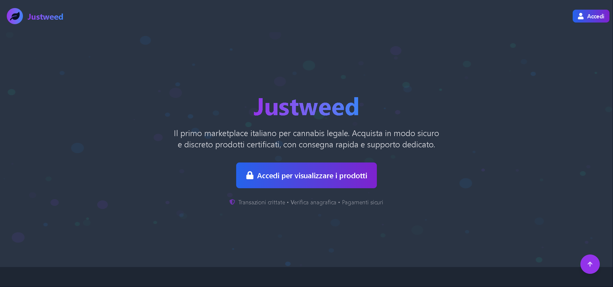

# 🌿 JustWeed - Il Tuo Spaccio di Fiducia (legale, tranquilli prof)

> _“Un piccolo passo per l’uomo, un grande passo per il traffico (digitale) di piante ornamentali dall’effetto molto, molto rilassante.”_  
> — Panora, Jhon (CEO, Sviluppatore, Fattorino, Magazziniere, e Sognatore)

## 📚 Premessa Seria™️

**JustWeed** è un progetto **100% goliardico**, realizzato **esclusivamente per il compito scolastico** di **Gestione Progetto d’Impresa (GPOI)** dell’**Istituto Pino Hensemberger**.  
Assegnato dalla prof.ssa **Santaniello**, il progetto prevedeva la simulazione dell’avvio di una start-up.  
Io, **Jhon Panora**, ho deciso di creare un sito e-commerce per la vendita di... ehm... **stupefacenti legali** 🫠  
Tutto a **scopo didattico** e con tanto amore per il codice.

---

## 🧠 Idea Geniale (o completamente fuori di testa?)

JustWeed nasce dall’idea di unire il mondo dell’e-commerce moderno con un concept goliardico e assurdo: vendere **erbe legali** online come se fossimo il **JustEat della canapa**.  
Un’esperienza immersiva nel business... ma fatta con **la leggerezza di una risata post-verifica**.

---

## 🛠️ Tech Stack da Brividi (di gioia)

Costruito con:

- ⚛️ **React** – per un frontend scattante e aromatico
- 🌬 **Tailwind CSS + DaisyUI** – per uno stile che spacca come un grinder nuovo
- 🧠 **Node.js** – server in pieno sballo (tecnologico)
- 🗃️ **MySQL** – il cuore pulsante del nostro “cartello” digitale
- 🧾 **Database j.panora** – strutturato con più tabelle per utente ma un solo DB per domarli

---
## 🗂️ Struttura del Progetto

> Quando spacciare codice diventa un’arte organizzata.

Il progetto **JustWeed** è diviso in due cuori pulsanti:

- 🧠 **Backend** – Dove la logica prende forma (e il PHP si sente ancora amato).
- 💅 **Frontend** – Dove l’utente si innamora (prima di cliccare "Aggiungi al carrello").

Ecco una panoramica della struttura, perché anche i veri spacciatori digitali tengono in ordine il magazzino:

<pre lang="md"><code>``` JUSTWEED ├── backend/ │ ├── controllers/ # La mente: gestisce tutte le operazioni tra frontend e DB │ ├── includes/ # Dove vivono i file di supporto (connessione DB, ecc.) │ ├── middleware/ # Filtri e controlli, tipo buttafuori dei dati │ └── routes/ # Le strade segrete del nostro impero legale └── frontend/ ├── public/ # Roba visibile a tutti (index.html, favicon, ecc.) └── src/ └── components/ ├── loader/ # Effetti visivi durante il caricamento ├── navbar/ # Navigazione tra le meraviglie ├── pages/ # Le “stanze” del sito, organizzate per funzionalità │ ├── aboutpage/ │ ├── account-info/ │ ├── blog/ │ ├── cart/ │ ├── certificazioni/ │ ├── checkoutpage/ │ ├── collaboratoriPage/ │ ├── confirm/ │ ├── contatti/ │ ├── cookie/ │ ├── footprint/ │ ├── forgotPassword/ │ ├── homeweeder/ │ ├── login/ │ ├── newpassword/ │ ├── notfount/ # (sì, è scritto così... errore 404 anche nel nome ❤️) │ ├── partnership/ │ ├── pre-weeder/ │ ├── privacypolicy/ │ ├── products/ │ ├── purchase/ │ ├── signup/ │ ├── single-product/ │ ├── sostenibilità/ │ ├── termini/ │ ├── trackpage/ │ └── weeder/ └── styles/ # Dove si veste tutto il sito (in verde ovviamente) ```</code></pre>

📌 **Nota di colore**: Il progetto è volutamente modulare per rendere semplice la manutenzione, l'espansione e... il passaggio dell’esame.

---

## 🧪 Funzionalità da vero boss della tech-foglia

- 🔍 Ricerca prodotti “da sballo”
- 🛒 Carrello che non dimentica mai i tuoi acquisti (ma tu magari sì)
- 📦 Ordini simulati, con spedizione immaginaria
- 👤 Profilo utente con tutte le informazioni utili (e inutili)
- 🧑‍🍳 Backend completamente gestito in casa, come la pasta della nonna

---

## 🤡 Disclaimer Obbligatorio (serio stavolta)

⚠️ **ATTENZIONE**: Questo progetto è **una parodia**, **non promuove né vende alcuna sostanza illegale**.  
Tutto è stato creato **a scopo educativo** per il progetto scolastico.  
Nessuna foglia è stata danneggiata nella realizzazione di questo sito (forse solo qualche neurone durante la fase di debug).

---

## 💼 Un da Capolavoro

Questo capolavoro è stato sviluppato **interamente in autonomia** da me, **Jhon Panora**, come simbolo di dedizione, passione, e capacità di prendersi poco sul serio anche quando si parla di... business.

> _ci ho messo mesi per farlo_

---

## 📸 Screenshot



---

## 🧾 Conclusione

JustWeed è la prova che anche i progetti più assurdi possono essere un’occasione per imparare, crescere e ridere.  
Grazie a chi leggerà questo README fino in fondo: ora sai che non sei solo tu a fare progetti fuori di testa per la scuola.

**Peace, love & Tailwind.** ✌️

---

> _JustWeed_ – dove la fantasia è legale e il codice è sempre open source.
